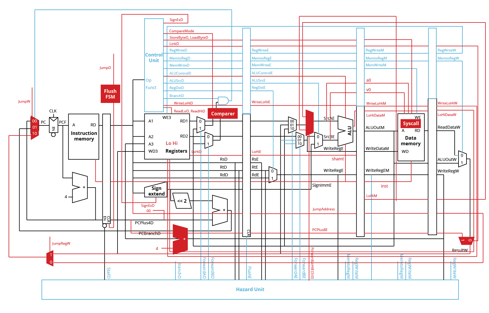
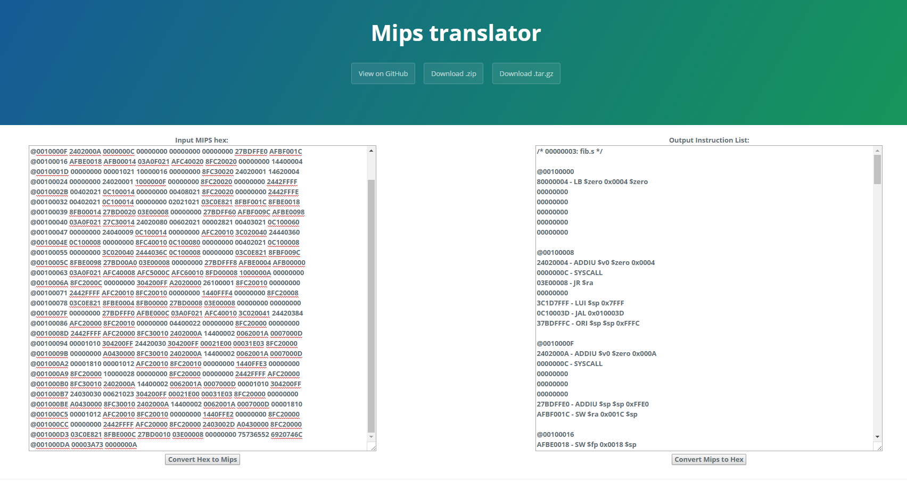

# MIPS CPU Project 2

Project 2 of the CSCI 320 class by Prof. Joshua Stough.  
Team members include:
* Tung Phan
* Son Pham
* Michael Hammer

# File Structure
We organize all our files into different folders, each containing files with specific purposes.
* **bin:** All executables. ```main``` is our verilog executable for our MIPS CPU.
* **docs:** All relevant documents for the project (Project Plan, Team Contract, and diagrams).
* **include:** contains the ```mips.h``` constant parameter list and the currently executed instruction file (```inst_mem.in```)
* **modules:** All module codes. We dedicate one file for each module most of the time, except for when the modules are highly similar, to make managing modules easier.
 * ``` adder.v```: Adder for calculating Program Counter.
 * ```ALU.v```: The ALU module.
 * ```comparer.v```: Generating the branch result for branch instructions.
 * ```control.v```: Control unit
 * ```dataMemory.v```: Data memory.
 * ```flushJump.v```: Computing flush signals.
 * ```hazardControl.v```: Hazard control module.
 * ```memory.v```: Instruction memory. 
 * ```muxer.v```: Muxers of all kind.
 * ```registers.v```: Registers.
 * ```pipeReg_PC```,```pipeReg_FD```, ```pipeReg_DE```,  ```pipeReg_EM```, ```pipeReg_MW```: Pipeline registers.  
 * ```signExtend.v```: Sign extension module.

The ```processor.v``` file is a top module that build the entire MIPS Pipeline CPU using the above mentioned modules.

* **test_programs:** There are several smaller folders included in test_programs
 * ```hello```, ```fib```,```cipher```: contain our 3 test_programs
 * ```itoa```, ```naked_fib```, ```test_puts```: contain tests for individual c functions ```itoa()```, ```fib()``` and ```puts()```.  

The folder also contains several verilog code for testing individual instructions.
* **mips_translator:** A supporting tool we created to help with converting MIPS and Hex back and forth.

* **stats:** A folder containing 3 raw stats file that we generated for each sample program. This information can be used to compute the performance of the program, as well as potentially visualise in the future.


Additionally, we have a Makefile structure to make the build process easier and a bash script called ```./chngTest.sh``` to manage test programs more efficiently. We will talk about these files in the Testing section.

# Design
We based our design on the 5-stage pipelined CPU implementation that is outlined in the Harris and Harris textbook. As we developed we had to diverge from their design. You can see our modifications in the diagram below.



#### Fetch Stage
The Fetch Stage handles using the program counter to retrieve the next instruction for the pipeline to execute.

* Instruction Memory Module: This module handles accessing memory to read out instructions based on the program counter.

#### Decode Stage
The Decode Stage handles using the instruction to determine the values it needs to use for the instruction. This is also where all the control signals are determined. The relevant control signals will be passed through the pipeline to following stages.

* Register File Module: This module handles the registers. It can output values from the registers or update the registers with new values. We had to implement special signals and operations in order to have the module update and read from the hi and low registers which cannot be accessed normally.
* Control Unit Module: This module uses the ```opcode``` and ```funccode``` to output signals that make the pipeline perform the actions necessary for an instruction to be completed correctly. We had to add more control signals, seen in the diagram above, in order to implement more features such as reading/writing hi and lo registers, controlling the sign extend module, and controlling more ALU operations.

#### Execute Stage
The Execute Stage uses the Arithmetic Logic Unit (ALU) to handle performing arithmetic operations defined by the instruction.

* ALU Module: This module performs arithmetic operations. We used a case statement and a control signal to determine which operation it should perform. For multiplication and division arithmetic we had to output a new 64-bit wire to carry the entire value.

#### Memory Stage
The Memory Stage handles extracting/writing values from/to memory. It is also where we implemented the Syscall operation.

* Data Memory Module: This module handles writing and reading data to/from memory. It also handles performing syscalls. We implemented syscalls at the end of this module’s execution because it is at the end of the pipeline. At this point we can be sure that values from previous instructions have been successfully updated before a syscall exits the program. The data memory module also gave us access to memory for performing print operations.

#### Writeback Stage
The Writeback Stage handles writing values into registers from the Register File Module. We also designed our pipeline so that this stage controls the pipeline to jump.

#### Additional Features
* Pipeline Registers: These modules handle storing and propagating values between stages of the pipeline.
* Jumping Logic: When we determine there will be a jump, we use a finite state machine to flush out the later pipeline instructions.
* Branch Delay Slot: In the decode, when we determine there will be a branch, there used to be a PCSrcD wire that flushed the pipeline register between Fetch and Decode. This did not allow for a branch delay slot so we removed it. Now, the instruction after a branch will stay in the pipeline and be executed.
* Forwarding: Signals from the Hazard Unit and hardware in the pipeline control forwarding values to subsequent instructions. We had to implement new hardware in order to handle forwarding values to our new hi and lo registers.
* Hazard Unit: This module handles hazards such as forwarding, stalling, and flushing. We had to add control signals to handle forwarding for the hi and lo registers.

# Sample Programs
## Program 1
Provided program that simply prints out "Hello World!".

## Program 2
Provided program that calculated the n-th Fibonacci number. For our test case, we try to run with n = 9.

## Program 3
Our own program that implements two simple encryption algorithms - XOR cipher and MOD cipher. Given an original numeric message (potentially SSN or credit card number), we demonstrate how we can encode it to value, and decode it back to the original message when we have the correct keys. Our own program uses 3 more instructions than Fibonacci, specifically: XOR, MULT, and BGTZ. To verify this, we put the compiled HEX code into our helper tool, put it in a google doc and mark all additional instructions.
[Third program - TungstenHammer](https://docs.google.com/a/bucknell.edu/document/d/1LpMxhJ6OFxsBnMt2A4NAqDDiY4MnyoHTBfLEwTVbND4/edit?usp=sharing)

# Compilation / Running Sample Programs

We create a Makefile hierarchy to make the building process more convenient. However, you can still go into each test program to make that particular verilog programs.

The address of the instruction file is set inside the instruction memory (```memory.v```) module. Changing this address every single time is extremely inconvenienet. Therefore, we developed a bash script called ```./chngTest.sh``` to overwrite the ```inst_mem.in``` program inside the ```include``` folder with the program we want to test. The address inside ```memory.v``` can remain consistent as that of ```inst_mem.in```.

To compile and run **all 3 programs**, you can run the following commands from the base folder.
```
make
make run
```

To run **an individual program**, you can run the following commands from the base folder.
```
make
./chngTest hello/hello.v
./bin/main
```
This will run the CPU on first program ```hello/hello.v```. To change the test program, execute the following commands.
```
./chngTest.sh fib/fib.v
./chngTest.sh cipher/cipher.v
./chngTest.sh test-program-name
```

* If you test any programs other than the ```fib/fib.v```, ```cipher/cipher.v``` and ```hello/hello.v```, please change the starting address inside ```pipeReg_PC.v``` module from ```0x00400030``` to ```0x00400000```

* If you want to **run program with debug info**, go to ```include/mips.h``` and change the flag ```DEBUG_PRINT``` to be true (1'b1).

* If you want to **run program with performance stats** (clock and instruction count), go to ```include/mips.h``` and change the flag ```STATS_PRINT``` to be true (1'b1).

# Testing Methodology
### Testing and debugging process
In an ideal world, all instructions and all modules should have their own test programs to make sure they function correctly in the big MIPS CPU. Unfortunately, there are too many intricacies involved in the MIPS CPU and we simply don’t have enough time to do so for this project. Therefore, we instead develop a top-down testing methodology. Which is described as followed:
* **Run the whole CPU with the program.**
* **If the program has problems,** then run the CPU with each line of the program.
* **If the line has problems,** then run that line with information about each cycle.
* **If the cycle has problems,** then trace it back to the problematic instruction.
* **Fix the bug**
* **Test the fix** to ensure the module is still functional.

At this point, we usually already figured out the bug and determine what we should do to fix the problem. This approach is good because it helps us find the bug in a relatively streamlined manner. It also prevents us from confusing the effects of different bugs in case two bugs appear.

# Performace Metrics
All raw stats files can be found in ./stats/

## Program 1 - hello.v

Number of clock cycles = 37

Instruction count = 24

IPC = 0.649

## Program 2 - fib.v (n=9)

Number of clock cycles = 5963

Instruction count = 5031

IPC = 0.844

## Program 3 - cipher.v

Number of clock cycles = 5056

Instruction count = 4587

IPC = 0.907

### Supporting tool


During the debugging stage, we encounter one looping bug and was forced to trace the program flow instruction and instruction. Translating Hex to MIPS by hand is an *extremely inconvenient* process. Therefore, we build a tool to help us translate the entire program to MIPS instruction automatically. The tool can be found in ```mips_translator``` folder. To use the tool, simply go to ```index.html```, copy the program and click “Convert to MIPS” to generate the MIPS sequence.

To ensure our fix was right, we usually end up writing a small test program. Again, converting MIPS sequence back to Hex is also a very inconvenient process. The tool once again comes into place! We can simply type the sequence of instructions line by line on the right side and the tool will generate a hex sequence of that small program for us.

The tool can be public accessed via this link: https://tungpm.github.io/mips_translator/extra_credit/index.html

# Visualizing the pipeline

Coming soon...

